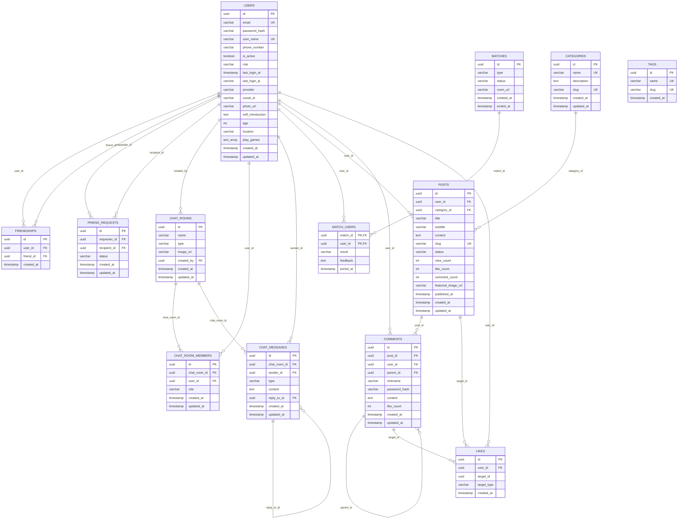

# Make Friend Backend

## 프로젝트 개요

사용자 매칭, 채팅, 게시글 기능을 제공하는 소셜 플랫폼 백엔드

## 데이터베이스 ERD



## 기술 스택

- **Backend**: NestJS
- **Database**: PostgreSQL
- **ORM**: TypeORM
- **Authentication**: JWT
- **Real-time**: WebSocket
- **File Storage**: AWS S3

## 주요 기능

- 사용자 인증 및 관리
- 친구 요청 및 관리
- 실시간 채팅
- 게임 매칭
- 게시글 및 댓글
- 파일 업로드

## 설치 및 실행

### 환경 요구사항

- Node.js 18+
- PostgreSQL 13+
- Redis 6+

### 설치

```bash
npm install
```

### 환경 설정

```bash
cp .env.example .env
# .env 파일을 편집하여 데이터베이스 및 기타 설정을 구성
```

### 실행

```bash
# 개발 모드
npm run start:dev

# 프로덕션 모드
npm run build
npm run start:prod
```

## API 문서

- Swagger UI: `http://localhost:3000/api`

## 라이선스

MIT
